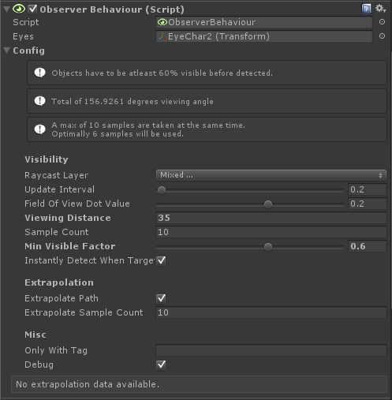

# Observer

The observer can detect [sight targets](SightTarget.md). Various configurations can be set to tweak the observer to your needs.

.. raw:: html

	<iframe width="560" height="315" src="https://www.youtube.com/embed/OOVI5Snfw9E" frameborder="0" allow="autoplay; encrypted-media" allowfullscreen></iframe>

-   **Eyes:** The eyes are the starting position of the raycasts. This should either be the observer gameObject or a child object of the observer. In most cases it's recommended to create a child object and use this as the eyes for optimal control.
-   **Raycast layer:**  The layers used to detect the sight targets. It's recommended to disable (uncheck) the sight layer and hearing layer from this layer mask.
-   **Update interval:**  The interval in seconds. An interval of 0.2 will update 5 times a second (updates once every 0.2 seconds).
-   **Field of view Dot value:**  The field of view value represented as a DOT value. The value is serialized as a dot value for performance reasons. At the top of the configuration the field of view is given in degrees.
-   **Viewing distance:**  The distance an object can detect sight targets.
-   **Sample count:** The amount of samples that will be taken in order to determine of an object is visible or not. The higher the sample count the more accuracy, however the slower the performance. **A maximum of 20 samples is recommended.**
-   **Min visible factor:** The minimal visibility of a target before it can be detected. The value is presented in percentages at the top.
-   **Instantly detect when target is fully visible:** If a target is 'fully' visible (90+%) should it skip the detection time and detect the target instantly?
-   **Extrapolate path:** When path extrapolation is enabled observers will keep track of targets and try to guess their direction.
-   **Extrapolate sample count:** The amount of samples that should be used for the extrapolation algorithm. The more samples the more accuracy, however the larger the footprint will be. When using a sample count of 10, 10 samples will be taken each at update interval (0.2 seconds) apart resulting in 2 seconds of extrapolation data. **A value below 20 is recommended.**
-   **Only with tag:** Only detect targets that have a specific tag. When left blank all targets will be detected.
-   **Debug:** When enabled show the rays used to detect targets.

## Programming

Los Pro also has a great programming backend. See the  [IObserverCallbacks]() and  [IObserver]() documentation on how to implement this with your own code. Want to detect a  [target](Target.md) with custom code? Have a look at [ISightTarget]().