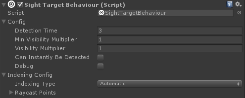

# Sight Target

Sight targets can be detected by [Observers](Observer.md) or an implementation of  [Sight](Sight.md). You can also create your own  [ISightTarget](ISightTarget.md) implementation allowing for full control.

.. raw:: html

	<iframe width="560" height="315" src="https://www.youtube.com/embed/OOVI5Snfw9E" frameborder="0" allow="autoplay; encrypted-media" allowfullscreen></iframe>

-   **Detection time:** The time it takes to detect this target in seconds. **The object has to be visible enough (min visible factor) by the observer before the timer starts.**
-   **Min visibility multiplier:** The minimal visibility multiplier of this target, as defined by the observer. A value of 1 will not affect the minimal visibility. A value of 2 will make this target 2x as difficult to detect. A value of 0.5 will make this object 2x easier to detect (50% less difficult).
-   **Can instantly be detected:** When the target is fully visible should it skip the detection time and become instantly detected?
-   **Debug:** When debug is enabled debug messages are logged to the Unity console. Note this can have a negative impact on performance inside the Unity editor.
-   **Indexing type:**
    -   Automatic: When the indexing type is set to automatic a number of samples will auto. be taken from the object. The amount is defined in the observer's configuration. **For skinned meshes it's recommended to use manual indexing.**
    -   Manual: When the indexing type is set to manual the specified list of "raycast points" will be used.  **When choosing a manual indexing type the sample count, as defined in the observer, will be overwritten. For example, when defining 10 points manually 10 samples will be taken, even if the observer's sample count is set to something else.**
-   **Raycast points:** The points (transforms) used when manual indexing is enabled. When using skinned meshes it's recommended to use the bone's transforms. This will increase performance and give the best accuracy.

Also have a look at the  [sight target debugger](../Editors/SightTargetDebugger.md).