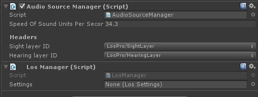
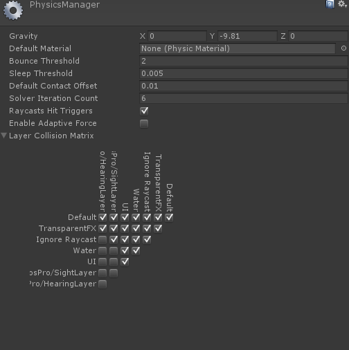

# Los Pro Getting Started

.. raw:: html

    

		<iframe width="560" height="315" src="https://www.youtube.com/embed/OOVI5Snfw9E" frameborder="0" allow="autoplay; encrypted-media" allowfullscreen></iframe>
	

## Adding managers to the scene

First off, the manager(s) need to be added to the scene. Create a new empty gameObject and name it "_Managers". Next add the AudioSourceManager and the LosManager to this object, or use the AudioSourceManager2D if you have a 2D project.

The LosManager is a manager component that can be contains a reference to the settings database. The settings database contains the global configurations for Los Pro.

To create the LOS settings object go to your projects pane (assets) and go to Create > LosPro > Los Settings. This will create an object in your project folder.

Next, go to your manager and assign the previously created Los Settings object.

## Collision matrix

To improve performance and avoid collision with unwanted objects the collision matrix can be set up. Make sure the Sight layer and hearing layer are not colliding. This can be achieved by making sure the vertical and horizontal row are both unchecked for the each layer. Additional layers can also be disabled, such as the UI, Ignore raycasts and water.

## Start adding observers and targets

And finally  [observers](Components/Observer.md) and  [targets](Components/Target.md) can be added to your scene.